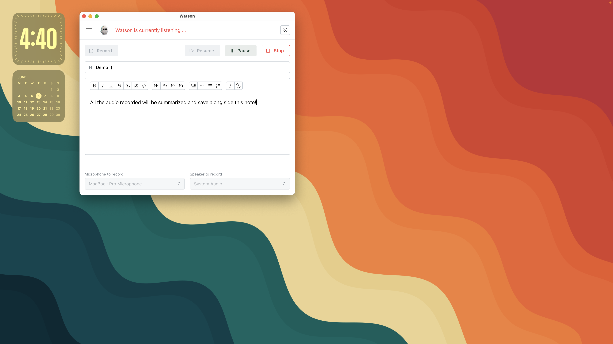
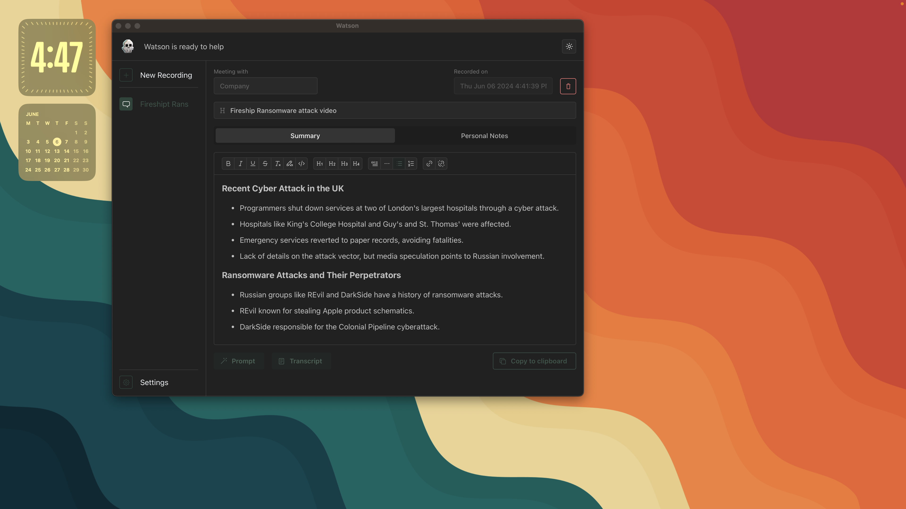

# Watson.ai 🔎 | Meeting Recorder & Summarizer

Easily record and extract the most important information from your meetings in English, French, and Chinese!

[Download the app here](https://github.com/LatentDream/watson.ai/releases/latest)

Supported platform: MacOS, Windows
- The app and not signed, you will need to allow the app in the security settings of your OS.

Watson.ai was original developed as an internal tool to help me record and summarize the endless stream of meetings. Previous version are not public but I'm planning to continue development here and make it available to everyone! :)


## API token needed: 
Enter your API token in the app settings to use the transcription feature.
1. AssemblyAI: [link](https://www.assemblyai.com/)
2. OpenAI API: [link](https://openai.com/)
3. _Optional_ Affinity API: [link](https://www.affinity.co/)

## Disclaimer:
Please be aware that recording meetings without consent may not be legal in all regions. By using Watson.ai for meeting recording and summarization, you acknowledge and agree that it is your responsibility to comply with all relevant laws and regulations regarding recording conversations. The developer of Watson.ai provides no legal guarantees or assurances regarding the legality of recording meetings in your jurisdiction. The use of Watson.ai is at your own risk, and the developer accepts no liability for any misuse or legal consequences arising from the use of the application.

## App Demo



---

### FFMPEG Binary needed as it is bundle with the app
Add you platform here: 
```
src-tauri/bin/ffmpeg-aarch64-apple-darwin
src-tauri/bin/ffmpeg-x86_64-apple-darwin
src-tauri/bin/ffmpeg-x86_64-pc-windows-msvc.exe
```
_Tips_: `which ffmpeg` to find the path of your ffmpeg binary and `cp /path/to/ffmpeg /path/to/watson/src-tauri/bin/ffmpeg-{{platform}}`

### Start App

#### Install dependencies
```
cargo install tauri-cli --version "^1.0.0" --locked
npm install
```

#### Run the app
```
cargo tauri dev
cargo tauri build
```

### Quick link
- Auto-update [docs](https://tauri.app/v1/guides/distribution/updater/)
- Async process in Rust + communication with webview [link](https://rfdonnelly.github.io/posts/tauri-async-rust-process/)
