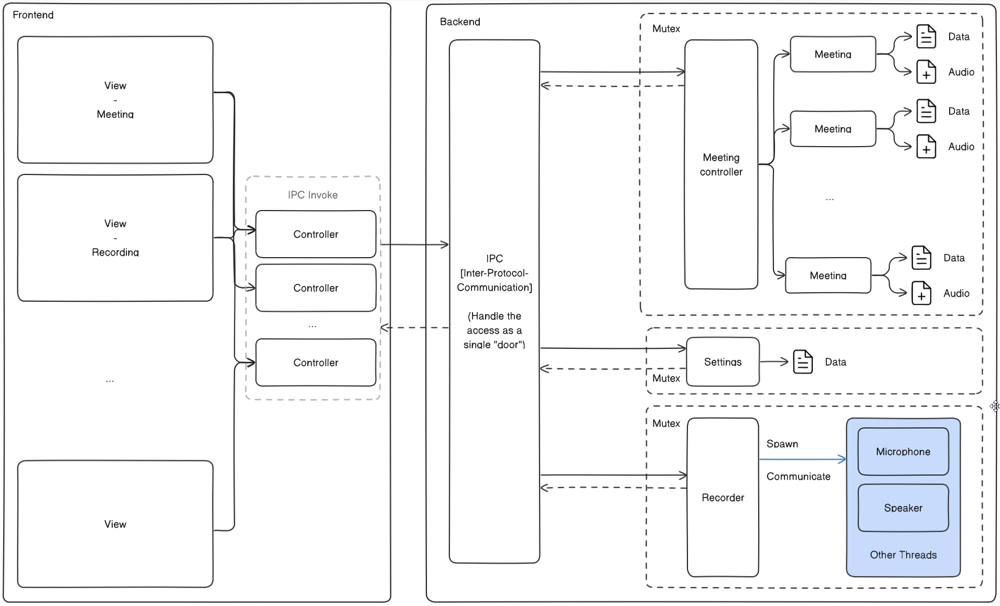

# Detective Watson 🔎 | Meeting Recorder & Summarizer

Easily record and extract the most important information from your meetings!

[Download the app here](https://github.com/LatentDream/watson.ai/releases/latest)

Supported platform: MacOS, Windows
- The app and not signed, you will need to allow the app in the security settings of your OS.

Watson.ai was original developed as an internal tool to help us record and summarize our meetings. Previous version are not public but I'm planning to continue development here and make it available to everyone! :)

## API token needed: 
Enter your API token in the app settings to use the transcription feature.
1. AssemblyAI: [link](https://www.assemblyai.com/)
2. OpenAI API: [link](https://openai.com/)
3. _Optional_ Affinity API: [link](https://www.affinity.co/)

## App Demo


---
# Development

- [ ] Website
- [ ] Sign the app
- [ ] Refactor Frontend code + convert to shadcui
- [ ] Integrate screen capture kit to cpal to have a commun interface instead of conditional compilation
- [ ] Store API key in keychain

### FFMPEG Binary needed as it is bundle with the app
Add you platform here: 
```
src-tauri/bin/ffmpeg-aarch64-apple-darwin
src-tauri/bin/ffmpeg-x86_64-apple-darwin
src-tauri/bin/ffmpeg-x86_64-pc-windows-msvc.exe
```
_Tips_: `which ffmpeg` to find the path of your ffmpeg binary and `cp /path/to/ffmpeg /path/to/watson/src-tauri/bin/ffmpeg-{{platform}}`

### Start App
```
npm install
cargo tauri dev
cargo tauri build
```

## Usefull docs

### Architecture overview 


### Quick link
- Auto-update [docs](https://tauri.app/v1/guides/distribution/updater/)
- Async process in Rust + communication with webview [link](https://rfdonnelly.github.io/posts/tauri-async-rust-process/)
